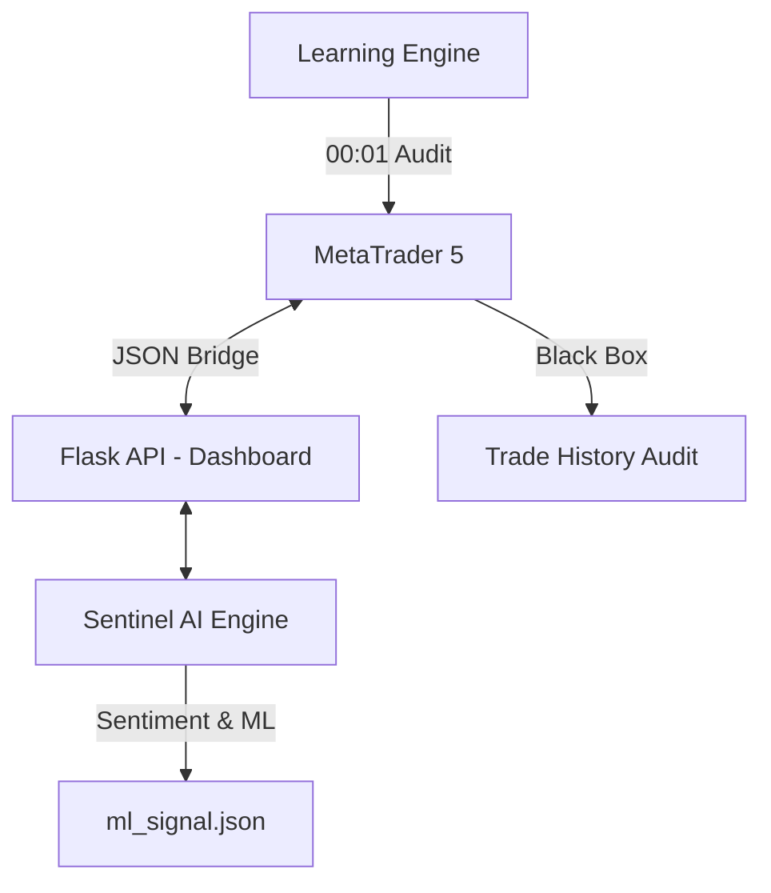

# 🏰 SENTINEL V7.25 ALADDIN PRO — UNIFIED COMMAND CENTER

> **Système de Trading Haute Précision (Sniper Mode)**
> Architecte : Ambity Project | Version : 7.25+ | **EA MT5 : Aladdin_Pro_V7_Live_DEPLOYED.mq5**

---

## 🛡️ Architecture Sniper (Anti-Zombie)

Le système Sentinel V7.25 est conçu pour éliminer toute forme de trading impulsif ou non validé. Il repose sur une triple barrière de sécurité :

1.  **AI Veto (Hardened)** : Aucun trade ne peut être ouvert si le score de confiance de l'IA est inférieur à **75% (0.75)**.
2.  **Boîte Noire (Black Box)** : Chaque position enregistre son score IA et son RSI au moment de l'exécution directement dans le **Commentaire MT5**.
3.  **Moteur d'Apprentissage (Midnight Engine)** : Analyse quotidienne à 00:01 pour recalibrer les seuils de risque en fonction des pertes de la veille.

---

## 📐 Structure du Système

---

## 📂 Composants Clés

| Composant | Fichier | Rôle |
|---|---|---|
| **Expert Advisor** | `Aladdin_Pro_V7_Live_DEPLOYED.mq5` | Exécution, Veto IA 75%, Boîte Noire |
| **Command Center** | `app.py` + `templates/dashboard.html` | Visualisation temps réel & Audit Sniper |
| **ML Signal** | `ml_signal.json` | Flux de décision IA (Seuil Sniper requis : 75%) |
| **Learning Engine** | `adaptive_learning_engine.py` | Auto-ajustement des risques chaque soir à minuit |
| **History Audit** | `trade_history.json` | Journal de bord synchronisé (Correctif V7.25) |

---

## 🚀 Guide d'Audit et Performance

Pour évaluer la performance réelle du système, consultez le **Tableau d'Évaluation Sniper** sur le Dashboard :
- **IA Score** : Doit être > 70% pour être en zone verte.
- **Raisonnement** : Affiche les conditions exactes (RSI/ADX) extraites de la **Boîte Noire**.
- **Audit de Minuit** : Consultez `logs/learning.log` chaque matin pour voir les ajustements automatiques.

---

## 🔒 Protocoles de Sécurité Industrielle (P1-P10)

- **P1 - Magic Isolation** : Compartimentage des algorithmes.
- **P2 - Sniper Veto** : Blocage total si IA < 75%.
- **P3 - Black Box Logging** : Données gravées dans les commentaires MT5.
- **P4 - Anti-Zombie** : Plus de trading automatique sans validation IA.
- **P5 - Heartbeat System** : Surveillance de la connexion Python/MT5.

---

## 🛠️ Installation & Démarrage

1.  Compiler `Aladdin_Pro_V7_Live_DEPLOYED.mq5` dans MetaEditor.
2.  Lancer le Dashboard : `python app.py` (URL: http://localhost:5000).
3.  Lancer les services IA : `bash run_all.sh`.

---
© 2026 Ambity Project - Aladdin Pro Elite Division.
